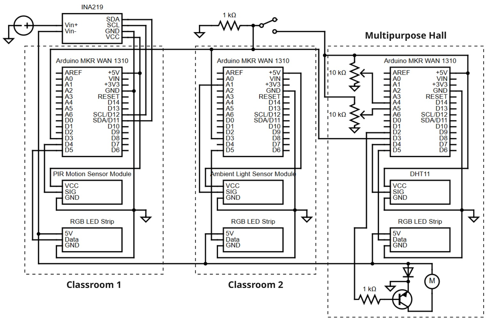

# 🌍 Smart Campus Digital Twin: Edge-Driven IoT Nodes


This repository contains the local edge-computing logic for the **Smart Campus Digital Twin** capstone project (RIT Dubai, 2026). The system utilizes a distributed IoT architecture to reduce energy consumption, employing Model Predictive Control (MPC) for HVAC pre-cooling, closed-loop daylight harvesting, and occupancy debouncing.

## 📂 Repository Structure

The physical 1:30 scale prototype relies on three distinct IoT edge nodes, each governed by an Arduino MKR WAN 1310.

```text
📦 Arduino_Edge_Nodes
 ┣ 📂 Classroom_1_Occupancy
 ┃ ┗ 📜 Classroom_1_Occupancy.ino   # PIR-based lighting control & INA219 power telemetry
 ┣ 📂 Classroom_2_Daylight
 ┃ ┗ 📜 Classroom_2_Daylight.ino    # LDR-based proportional PWM daylight harvesting
 ┣ 📂 Multipurpose_Hall_HVAC
 ┃ ┗ 📜 Multipurpose_Hall_HVAC.ino  # DHT11 thermal anomaly detection & AI pre-cooling HVAC
 ┗ 📜 README.md                     # You are here
```

## ⚙️ Operating Modes
All nodes feature a physical hardware interrupt (connected to `Pin 3`) to toggle between two operational states:
* **`AUTO` (Smart Campus Mode):** The node runs its autonomous edge logic, responding to local sensors, TTN downlinks, and scheduled overrides.
* **`ALL_ON` (Baseline Mode):** Simulates a legacy facility. All actuators (fans, lights) run at 100% capacity regardless of occupancy. Used for comparative energy Area-Under-Curve (AUC) analysis.

---

## 🛠️ Hardware & Pinouts

<!--  -->
<p align="center">
  
</p>

### Global Requirements
* **Microcontroller:** Arduino MKR WAN 1310 (x3)
* **Power Supply:** Mean Well MDR-20-5 (5V/3A) with NPN/Flyback diode load isolation.

### Node 1: Classroom 1 (Occupancy)
| Component | Pin | Notes |
| :--- | :--- | :--- |
| PIR Motion Sensor | `D4` | Triggers lighting state (2000ms debounce) |
| NeoPixel Strip | `D6` | 38 LEDs. Simulated building lighting load |
| Status LED | `D2` | 1Hz Heartbeat blink |
| INA219 Sensor | `I2C (SDA/SCL)` | Captures total average power consumption |
| Hardware Switch | `D3` | Toggles `AUTO` / `ALL_ON` modes |

### Node 2: Classroom 2 (Daylight Harvesting)
| Component | Pin | Notes |
| :--- | :--- | :--- |
| LDR (Ambient Light) | `A1` | Measures solar gain for proportional dimming |
| Potentiometer | `A2` | Simulates manual user override (10s auto-revert) |
| NeoPixel Strip | `D5` | 38 LEDs. PWM Dimming target |
| Hardware Switch | `D3` | Toggles `AUTO` / `ALL_ON` modes |

### Node 3: Multipurpose Hall (HVAC & Safety)
| Component | Pin | Notes |
| :--- | :--- | :--- |
| DHT11 Sensor | `D5` | Thermal telemetry & Anomaly detection ($dT/dt$) |
| Temp Potentiometer | `A5` | Simulates localized user temperature requests |
| Occ Potentiometer | `A4` | Simulates physical occupancy counts |
| AHU Fan Control | `D2` | PWM control via NPN transistor |
| NeoPixel Strip | `D6` | 56 LEDs. Flashes Red during fire anomaly |
| Hardware Switch | `D3` | Toggles `AUTO` / `ALL_ON` modes |

---

## 💻 Software Dependencies

To compile and upload these scripts, install the following libraries via the Arduino IDE Library Manager:

1. **`MKRWAN`** (v1.1.0+) - Official LoRaWAN library for the MKR 1310.
2. **`Adafruit_NeoPixel`** - For addressing the simulated lighting loads.
3. **`DHT sensor library`** by Adafruit - For the Multipurpose Hall thermal readings.
4. **`INA219`** by Rob Tillart - For I2C power monitoring.

---

## 🚀 Setup & Deployment

1. Clone this repository to your local machine.
2. Open the desired `.ino` file in the Arduino IDE.
3. **Important:** Update the LoRaWAN OTAA keys before flashing!
   ```cpp
   String appEui = "[PLACEHOLDER: INSERT YOUR JOIN EUI HERE]"; 
   String appKey = "[PLACEHOLDER: INSERT YOUR APP KEY HERE]"; 
   ```
4. Connect your Arduino MKR WAN 1310 via USB, select the correct COM port, and click **Upload**.
5. Open the Serial Monitor (Baud Rate: `115200`) to verify TTN join status and sensor telemetry.

---

## 👥 Team
**RIT Dubai Senior Capstone 2026**
* Abigail Da Costa (CIT)
* Farheen Haniyah (CIT)
* Garima Singh (CIT)
* Joyce James Keeriath (EE) - *Hardware & Edge Logic*
* Sai Pratap Batreddi (CIT)

**Mentors:** Dr. Mohamed Abdelraheem and Dr. Ahmed Mostafa

